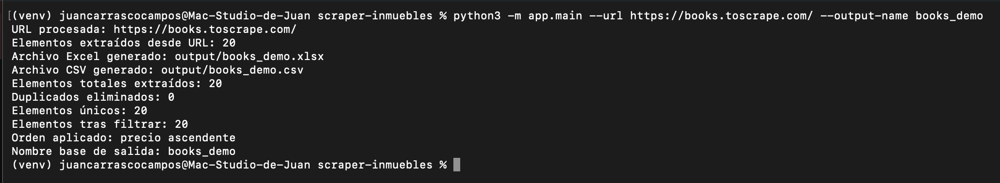
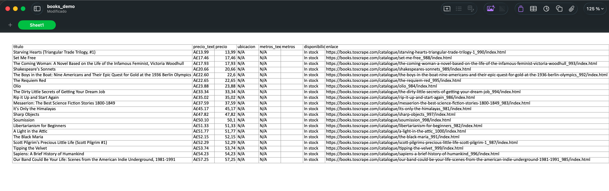
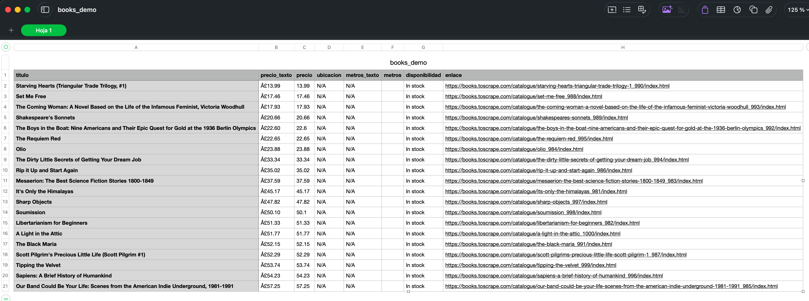

# Web Scraper Data Export CLI

Python CLI tool to extract structured data from HTML files or live URLs, clean fields, remove duplicates, filter results, sort them, and export to Excel and CSV.

## Quick Start

```bash
python3 -m venv venv
source venv/bin/activate
pip install -r requirements.txt
python3 -m app.main --url https://books.toscrape.com/ --output-name books_demo
...


<h2>Preview</h2>







## Features

- Parse one or multiple HTML files
- Parse data from a live URL
- Normalize numeric fields
- Deduplicate records by link or title
- Filter by city and max price
- Sort by price ascending or descending
- Export to Excel and CSV
- Custom output file name
- Command-line interface

## Tech Stack

- Python
- BeautifulSoup
- Requests
- Pandas
- OpenPyXL

## Project Structure

```bash
scraper-inmuebles/
│
├── app/
│   ├── main.py
│   ├── scraper.py
│   ├── parser.py
│   └── exporter.py
│
├── assets/
├── sample_properties.html
├── sample_properties_2.html
├── requirements.txt
└── README.md

## Instalación

Clona el repositorio y crea un entorno virtual:

git clone <TU_REPO_URL>
cd scraper-inmuebles
python3 -m venv venv
source venv/bin/activate
pip install -r requirements.txt

### Uso

1. Procesar un archivo HTML local
python3 -m app.main --input sample_properties.html

2. Procesar varios archivos HTML
python3 -m app.main --input sample_properties.html sample_properties_2.html

3. Filtrar por ciudad
python3 -m app.main --input sample_properties.html sample_properties_2.html --city Málaga

4. Filtrar por precio máximo
python3 -m app.main --input sample_properties.html sample_properties_2.html --max-price 200000

5. Ordenar por precio descendente
python3 -m app.main --input sample_properties.html sample_properties_2.html --desc

6. Elegir nombre de salida
python3 -m app.main --input sample_properties.html sample_properties_2.html --output-name malaga_filtrado


Esto generará:

output/malaga_filtrado.xlsx
output/malaga_filtrado.csv


7. Procesar una URL real
python3 -m app.main --url https://books.toscrape.com/ --output-name books_demo


## Salida

La herramienta genera dos archivos:

Excel (.xlsx)
CSV (.csv)

# Ejemplo de columnas exportadas:

titulo
precio_texto
precio
ubicacion
metros_texto
metros
disponibilidad
enlace


## Funcionalidades implementadas
Parsing de HTML estructurado
Adaptación a una web real de prueba
Soporte para múltiples fuentes
Deduplicación de registros
Filtros configurables
Ordenación
Exportación profesional


## Casos de uso

Este proyecto puede adaptarse fácilmente para:

scraping inmobiliario
extracción de productos ecommerce
comparadores de precios
directorios de empresas
lead generation
automatización de informes
Mejoras futuras
Soporte para paginación
Exportación a JSON
Soporte para múltiples selectores por web
Interfaz web simple
Programación automática de ejecuciones
Autor

Proyecto desarrollado por Juan Carrasco como parte de un portfolio orientado a automatización, scraping y trabajos freelance en Python.
